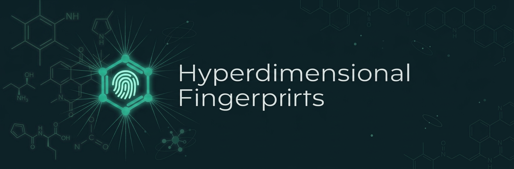

# Hyper Fingerprints




**Real-valued, fixed-size molecular fingerprints — no training, just NumPy.**

Hyper Fingerprints encodes molecules into continuous vector representations
using [Holographic Reduced Representations](https://doi.org/10.1109/72.377968)
(HRR) with graph message passing. The result is a deterministic, real-valued
fingerprint that works as a drop-in feature vector for similarity search,
clustering, or any downstream ML task.

<!--
## 🔬 Why Hyper Fingerprints?

Traditional molecular fingerprints like ECFP/Morgan use hash-based folding,
producing sparse binary bit vectors with unavoidable bit collisions. Learned
fingerprints (e.g., graph neural networks) require training data and a deep
learning stack.

Hyper Fingerprints takes a different approach:

- **Real-valued vectors** — continuous representations with no hash collisions,
  usable directly in ML pipelines without further embedding
- **Pure NumPy + RDKit** — no PyTorch, no TensorFlow, no GPU required.
  Deploys anywhere Python runs
- **Deterministic** — identical seeds produce identical fingerprints across
  machines and runs. No training variance
- **Configurable structural context** — the `depth` parameter controls how
  many bond-hops of neighborhood are captured, analogous to the radius
  parameter in Morgan fingerprints
- **Algebraically composable** — HRR binding and bundling preserve structural
  semantics in the vector space, enabling meaningful arithmetic on fingerprints
- **Joint representations** — `encode_joint()` gives both an atom-bag view
  (order-0) and a structure-aware view (order-N) in a single vector
-->

## 📦 Installation

Requires Python 3.9+.

Install from source:

```bash
git clone <repo-url>
cd hyper-fingerprints
pip install .
```

### Dependencies

- `numpy >= 1.24`
- `rdkit >= 2024.0.0`

## 🚀 Quick start

```python
from hyper_fingerprints import Encoder, cosine_similarity

enc = Encoder(dimension=512, seed=42)

# Encode molecules (SMILES strings or RDKit Mol objects)
fps = enc.encode(["CCO", "CO", "c1ccccc1"])  # shape: (3, 512), dtype: float64

# Cosine similarity — similar molecules get similar vectors
sim = cosine_similarity(fps, fps)

print(f"ethanol vs methanol: {sim[0, 1]:.3f}")   # high similarity
print(f"ethanol vs benzene:  {sim[0, 2]:.3f}")    # low similarity
```

See [`examples/00_quickstart.ipynb`](examples/00_quickstart.ipynb) for a full
walkthrough covering similarity search, joint fingerprints, custom atom types,
save/load, and scikit-learn integration.

## 📖 API

### Encoder

```python
Encoder(
    dimension=256,      # hypervector size
    depth=3,            # message-passing layers (structural context radius)
    atom_types=None,    # atom vocabulary (default: Br, C, Cl, F, I, N, O, P, S)
    seed=None,          # random seed for reproducible codebook generation
    normalize=False,    # L2-normalize after each message-passing layer
)
```

Molecules can be passed as SMILES strings, RDKit `Mol` objects, or lists of
either.

### Methods

**`encode(molecules) -> np.ndarray`** — Encode molecules into order-N
hypervector fingerprints. Returns shape `(batch_size, dimension)`.

**`encode_joint(molecules) -> np.ndarray`** — Concatenation of order-0 (atom
identity only, no structural context) and order-N (full message-passing)
embeddings. Returns shape `(batch_size, 2 * dimension)`. Useful when you want
both local atom-level and structural information in one vector.

### Persistence

**`save(path)`** / **`Encoder.load(path)`** — Persist and restore an encoder
(config + codebook) as a single `.npz` file. Useful for sharing a fixed
fingerprint scheme or deploying without needing to track the seed.

```python
enc.save("encoder.npz")
loaded = Encoder.load("encoder.npz")
```

### Parameter guidance

| Parameter | Guidance |
|:----------|:---------|
| `dimension` | 32-256 for Bayesian optimization. 1024-2048 as a starting point for property prediction. |
| `depth` | Controls structural context radius, analogous to Morgan radius. `depth=3` captures up to 3-bond neighborhoods. Higher values capture more global structure but increase computation. |

### Atom features

Each atom is described by 5 discrete features:

| Feature | Bins | Values |
|:--------|:-----|:-------|
| Atom type | `len(atom_types)` (varies with vocabulary) | Index into the atom vocabulary |
| Degree | 6 | 0-5 |
| Formal charge | 3 | neutral, positive, negative |
| Total Hs | 4 | 0-3 |
| Is aromatic | 2 | 0, 1 |

## ⚠️ Limitations

- **No bond type features** — bonds are treated as unweighted edges. Single,
  double, and aromatic bonds are not distinguished in the current feature scheme.
- **No stereochemistry** — chirality and cis/trans isomerism are not encoded.
- **No GPU acceleration** — the implementation is pure NumPy, which is a
  deployment strength but means large-scale encoding is CPU-bound.
- **Codebook scales with vocabulary** — the codebook has
  `product(feature_bins)` entries (1296 for the default 9 atom types). Large
  custom atom type lists will increase memory usage.

## 🧪 Development

Install dev dependencies:

```bash
pip install -e ".[dev]"
```

Run tests:

```bash
pytest
```

Run tests across Python 3.9-3.13 with nox:

```bash
nox -s tests
```

Fingerprint outputs are regression-tested against recorded fixtures to ensure
numerical stability across releases.

## 📚 References

This project builds on the theory of Holographic Reduced Representations and
Vector Symbolic Architectures:

- Plate, T. A. (1995). *Holographic Reduced Representations.* IEEE Transactions
  on Neural Networks, 6(3), 623-641.
  [doi:10.1109/72.377968](https://doi.org/10.1109/72.377968)
- Kanerva, P. (2009). *Hyperdimensional Computing: An Introduction to Computing
  in Distributed Representation with High-Dimensional Random Vectors.* Cognitive
  Computation, 1(2), 139-159.
  [doi:10.1007/s12559-009-9009-8](https://doi.org/10.1007/s12559-009-9009-8)

## 📄 License

This project is licensed under the MIT License.
